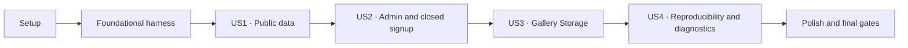

# Tasks: Fondation Supabase

**Input**: Design documents from `/specs/001-supabase-foundation/`

**Prerequisites**: `plan.md`, `spec.md`, `research.md`, `data-model.md`, `contracts/`, `quickstart.md`

**Tests**: Les tests sont obligatoires : `FR-020`, `SC-001` à `SC-010` et la constitution exigent les contrôles de contraintes, d'accès, d'Auth, de Storage, de reproductibilité et de non-exposition des secrets.

**Organization**: Les tâches sont groupées par user story. Une migration unique est créée par la CLI puis enrichie dans l'ordre US1 → US2 → US3 ; US4 reconstruit et contrôle le socle complet. `<cli-timestamp>` désigne exclusivement le préfixe réellement produit par `npx supabase migration new supabase_foundation`.

## Format: `[ID] [P?] [Story] Description`

- **[P]**: exécutable en parallèle dans un fichier distinct, sans dépendance inachevée ni exécution concurrente contre la même pile locale
- **[Story]**: user story correspondante (`US1` à `US4`)
- Chaque tâche indique les chemins exacts concernés ; aucune tâche n'ajoute d'interface, de contenu métier ou de mutation distante.

## Phase 1: Setup (Shared Infrastructure)

**Purpose**: Établir le runtime, les dépendances et la configuration locale initiale sans modifier l'interface existante.

- [X] T001 Déclarer Node.js 22 LTS dans `.nvmrc` et `package.json#engines` en conservant Next.js 16.3.0, React 19.2.8 et TypeScript strict
- [X] T002 Installer exactement `@supabase/supabase-js@2.112.2`, `@supabase/ssr@0.12.4`, `zod@4.4.3` et la devDependency `supabase@2.112.0`, puis mettre à jour `package.json` et `package-lock.json`
- [X] T003 Exécuter `npx supabase --help` puis `npx supabase init --help`, initialiser le projet uniquement avec la syntaxe confirmée et conserver le résultat dans `supabase/config.toml`
- [X] T004 [P] Ajouter uniquement `NEXT_PUBLIC_SUPABASE_URL` et `NEXT_PUBLIC_SUPABASE_PUBLISHABLE_KEY`, sans valeur réelle ni clé privilégiée, dans `.env.example`

---

## Phase 2: Foundational (Blocking Prerequisites)

**Purpose**: Créer la migration unique, le harnais de test et le contrat de diagnostic partagés par toutes les stories.

**⚠️ CRITICAL**: Aucune user story ne commence avant la création de ces fondations.

- [X] T005 Exécuter `npx supabase migration --help` puis créer `supabase/migrations/<cli-timestamp>_supabase_foundation.sql` avec la CLI, exécuter `npx supabase start --help`, démarrer la pile locale avec la syntaxe confirmée et vérifier son état avant les premiers tests
- [X] T006 [P] Créer les helpers pgTAP transactionnels pour fixtures, rôles SQL, claims JWT, utilisateurs et sessions locales, avec identifiants de contrôles préfixés `validation.`, `authorization.`, `privilege.` ou `internal.`, dans `supabase/tests/database/00_test_helpers.sql`
- [X] T007 [P] Créer dans `scripts/run-foundation-checks.mjs` le socle du lanceur avec garde loopback avant toute commande, refus de toute cible liée distante, forme de résultat, catégorie unique, ordre de priorité, caviardage des secrets, code de sortie et nettoyage garanti

**Checkpoint**: La pile locale peut démarrer, la migration possède un chemin CLI réel et les contrôles disposent d'un format de résultat stable.

---

## Phase 3: User Story 1 - Consulter uniquement le contenu public (Priority: P1) 🎯 MVP

**Goal**: Établir les deux tables contraintes et garantir que les profils publics ne voient que les contenus actifs, dans un ordre déterministe, sans droit d'écriture.

**Independent Test**: Après un reset local, les contraintes acceptent leurs limites valides et refusent les valeurs invalides ; `anon` et le connecté non-admin reçoivent uniquement les lignes actives triées par `ordre_affichage`, `created_at`, `id`, et chaque mutation échoue sans résidu.

### Tests for User Story 1

- [X] T008 [US1] Écrire puis exécuter en échec les tests pgTAP des colonnes, valeurs par défaut, contraintes nommées, prix exact, couplage `type_prix`/`prix`, chemins et métadonnées des deux tables dans `supabase/tests/database/01_schema_constraints.sql`
- [X] T009 [US1] Écrire puis exécuter en échec les tests pgTAP de lecture active, accès direct à une ligne inactive, refus de `INSERT`/`UPDATE`/`DELETE` et tri avec égalités pour `anon` et non-admin dans `supabase/tests/database/02_public_access.sql`
- [X] T010 [US1] Confirmer que `supabase/tests/database/01_schema_constraints.sql` et `supabase/tests/database/02_public_access.sql` échouent pour les contrôles attendus avant de modifier `supabase/migrations/<cli-timestamp>_supabase_foundation.sql`

### Implementation for User Story 1

- [X] T011 [US1] Ajouter le schéma `private`, `private.set_updated_at()` à `search_path` vide, `public.prestations`, `public.photos_galerie`, leurs contraintes nommées, triggers et index partiels dans `supabase/migrations/<cli-timestamp>_supabase_foundation.sql`
- [X] T012 [US1] Fermer les privilèges par défaut des futures tables, séquences et fonctions, accorder les `GRANT SELECT` minimaux, activer RLS et ajouter les politiques publiques `SELECT` sur `actif = true` sans politique de mutation dans `supabase/migrations/<cli-timestamp>_supabase_foundation.sql`
- [X] T013 [US1] Réinitialiser la base locale et faire réussir `supabase/tests/database/01_schema_constraints.sql` et `supabase/tests/database/02_public_access.sql` sans seed métier ni modification manuelle de la base

**Checkpoint**: US1 fournit un socle public sécurisé et ordonné ; aucune page n'est encore branchée sur Supabase.

---

## Phase 4: User Story 2 - Administrer les données avec une autorisation fiable (Priority: P2)

**Goal**: Accorder la lecture complète et les mutations uniquement à un compte dont le rôle contrôlé et la session sont valides, tout en désactivant chaque auto-inscription publique.

**Independent Test**: Le non-admin, `user_metadata` et un ancien JWT révoqué restent limités à la lecture publique ; l'admin courant peut lire et muter les deux tables ; les appels Auth publics email et anonymes sont refusés sans création d'utilisateur.

### Tests for User Story 2

- [X] T014 [US2] Écrire puis exécuter en échec dans `supabase/tests/database/03_admin_table_access.sql` la matrice `SELECT`/`INSERT`/`UPDATE`/`DELETE` pour non-admin, admin courant, `user_metadata`, promotion et session révoquée, et vérifier que `updated_at` avance et remplace toute valeur forgée lors d'un update autorisé
- [X] T015 [US2] Écrire puis exécuter en échec `scripts/check-auth-signup.mjs` avec garde loopback, capture en mémoire de la capacité administrative depuis la sortie machine de `supabase status`, comptage avant/après, appels publics email et anonyme, inventaire SMS/OTP/fournisseurs, fixtures jetables, nettoyage et sortie structurée conforme à `specs/001-supabase-foundation/contracts/diagnostics.md` sans jamais afficher la capacité locale
- [X] T016 [US2] Confirmer les échecs attendus de `supabase/tests/database/03_admin_table_access.sql` et `scripts/check-auth-signup.mjs` avant de modifier `supabase/migrations/<cli-timestamp>_supabase_foundation.sql` et `supabase/config.toml`

### Implementation for User Story 2

- [X] T017 [US2] Ajouter `private.is_current_admin()` en `security definer`, avec `search_path = ''`, contrôle de `app_metadata.role`, `session_id`, `auth.uid()` et droit `EXECUTE` limité à `authenticated`, dans `supabase/migrations/<cli-timestamp>_supabase_foundation.sql`
- [X] T018 [US2] Accorder les mutations à `authenticated` puis ajouter les politiques admin séparées `SELECT`, `INSERT`, `UPDATE USING/WITH CHECK` et `DELETE` avec `(select private.is_current_admin())` dans `supabase/migrations/<cli-timestamp>_supabase_foundation.sql`
- [X] T019 [US2] Définir `auth.enable_signup = false`, `auth.enable_anonymous_sign_ins = false`, `auth.email.enable_signup = false`, `auth.sms.enable_signup = false` et garder les fournisseurs externes désactivés dans `supabase/config.toml`
- [X] T020 [US2] Redémarrer la pile locale après `supabase/config.toml`, réinitialiser la base et faire réussir `supabase/tests/database/03_admin_table_access.sql` et `scripts/check-auth-signup.mjs` avec tous les tests US1 encore verts

**Checkpoint**: US2 livre l'autorisation de base et la fermeture Auth sans écran de connexion, route d'inscription, `proxy.ts` ni clé privilégiée applicative.

---

## Phase 5: User Story 3 - Protéger les fichiers de la galerie (Priority: P3)

**Goal**: Diffuser publiquement les objets du bucket `galerie` tout en réservant la liste et chaque écriture à l'administrateur courant sous un chemin UUID v4 canonique.

**Independent Test**: Un vrai téléchargement HTTP public réussit ; `anon`, non-admin et admin révoqué ne peuvent ni lister de façon découvrable, envoyer, remplacer ou supprimer ; l'admin réussit chaque permission isolée et les limites de chemin, MIME et taille sont appliquées sans résidu.

### Tests for User Story 3

- [X] T021 [US3] Écrire puis exécuter en échec les assertions pgTAP du bucket, de la limite 8 MiB, des trois MIME, des quatre politiques Storage, des bornes de chemin et des permissions d'upsert dans `supabase/tests/database/04_storage_policies.sql`
- [X] T022 [US3] Écrire puis exécuter en échec `scripts/check-supabase-storage.mjs` avec garde loopback, capacité locale capturée en mémoire uniquement pour les fixtures, sessions réelles et clé publiable pour chaque opération Storage, `fetch` public, quatre profils, upload/upsert/delete, limites, invariance, nettoyage `finally` et sortie structurée conforme à `specs/001-supabase-foundation/contracts/diagnostics.md`
- [X] T023 [US3] Confirmer les échecs attendus de `supabase/tests/database/04_storage_policies.sql` et `scripts/check-supabase-storage.mjs` avant de modifier `supabase/config.toml` et `supabase/migrations/<cli-timestamp>_supabase_foundation.sql`

### Implementation for User Story 3

- [X] T024 [P] [US3] Déclarer le bucket public `galerie`, la limite de 8 MiB et les MIME `image/jpeg`, `image/png`, `image/webp` dans `supabase/config.toml` sans fichier image seedé
- [X] T025 [P] [US3] Ajouter les politiques `storage.objects` `SELECT`, `INSERT`, `UPDATE` avec `USING` et `WITH CHECK`, puis `DELETE`, toutes bornées à l'admin courant, au bucket `galerie` et à `photos/<uuid-v4-minuscule>.<extension-autorisée>`, dans `supabase/migrations/<cli-timestamp>_supabase_foundation.sql`
- [X] T026 [US3] Reconstruire la pile et le bucket avec les commandes confirmées par `--help`, puis faire réussir `supabase/tests/database/04_storage_policies.sql` et `scripts/check-supabase-storage.mjs`, y compris les suppressions isolées objet/métadonnée suivies du nettoyage complet

**Checkpoint**: US3 prouve les permissions Storage séparées ; elle ne génère aucun chemin de production et ne livre aucun workflow coordonné de suppression de photo.

---

## Phase 6: User Story 4 - Reproduire et contrôler le socle (Priority: P4)

**Goal**: Reconstruire le socle depuis zéro, fournir des clients Next.js typés à clé publiable et produire un bilan de contrôles catégorisé, reproductible et sans secret.

**Independent Test**: Une seule procédure locale reconstruit migration et bucket, restitue 40 prestations et 100 photos dans un ordre stable, régénère des types identiques, initialise les clients avec les seules variables publiques et fait réussir un rapport où chaque échec possède exactement une catégorie.

### Tests for User Story 4

- [X] T027 [P] [US4] Écrire l'inventaire pgTAP des tables, contraintes, triggers, index, RLS, politiques, `GRANT` courants et privilèges par défaut fermés dans `supabase/tests/database/05_foundation_inventory.sql`
- [X] T028 [P] [US4] Écrire dans `supabase/tests/database/06_scale_and_order.sql` les tests de 40 prestations réparties dans les trois catégories et 100 photos réparties dans les cinq variantes, insérées par une fixture autorisée puis relues comme `anon` avec ordres dupliqués et tri déterministe sans pagination
- [X] T029 [P] [US4] Ajouter puis observer en échec dans `scripts/run-foundation-checks.mjs` la matrice de `lib/supabase/env.ts` via la suppression native des types de Node.js 22 confirmée par `node --help`, couvrant loopback HTTP, HTTPS distant, faux loopback, HTTP distant, identifiants, fragments, protocole non HTTP(S), URL et clé vides

### Implementation for User Story 4

- [X] T030 [US4] Après l'échec attendu de T029, implémenter avec Zod une fonction pure de validation publique, sans valeur sensible dans les erreurs, et exposer la configuration validée dans `lib/supabase/env.ts`
- [X] T031 [P] [US4] Réinitialiser la base complète, générer les types du schéma `public` avec la commande CLI confirmée par `npx supabase gen types --help` et versionner le résultat dans `lib/supabase/database.types.ts`
- [X] T032 [P] [US4] Après T030 et T031, créer le client navigateur typé `createBrowserClient<Database>` utilisant uniquement la configuration publique validée dans `lib/supabase/client.ts`
- [X] T033 [P] [US4] Après T030 et T031, créer la fabrique serveur par requête avec `import "server-only"`, `createServerClient<Database>`, `await cookies()` et adaptateurs `getAll`/`setAll` dans `lib/supabase/server.ts`
- [X] T034 [US4] Compléter `scripts/run-foundation-checks.mjs` pour imposer `--local` à chaque commande Supabase, orchestrer reset, pgTAP, sorties JSON Auth/Storage, lint DB, advisors, dérive des types via fichier temporaire, ESLint, TypeScript, build et scan post-build, avec identifiants stables, catégorie unique et aucune sortie sensible
- [X] T035 [US4] Ajouter dans `package.json` les commandes locales de reset, tests DB, contrôles Auth/Storage, lint/advisors, génération et dérive des types, rapport de fondation, lint, TypeScript, build et scan de secrets sans inscrire de secret dans les scripts
- [X] T036 [US4] Exécuter depuis zéro `scripts/run-foundation-checks.mjs`, `supabase/tests/database/05_foundation_inventory.sql` et `supabase/tests/database/06_scale_and_order.sql`, puis confirmer la réussite de toute la procédure décrite dans `specs/001-supabase-foundation/quickstart.md`

**Checkpoint**: US4 rend la fondation reconstruisible, typée et contrôlable sans brancher les pages publiques ou l'administration.

---

## Phase 7: Polish & Cross-Cutting Concerns

**Purpose**: Synchroniser la documentation et appliquer les gates finaux proportionnés au risque.

- [X] T037 [P] Vérifier et synchroniser le modèle, l'identité, les responsabilités des clients et les limites des workflows Storage avec l'implémentation réelle dans `doc/spec.md` et `doc/architecture.md`
- [X] T038 [P] Vérifier et synchroniser les versions, variables, règle loopback/HTTPS, bucket, fermeture Auth et futur handoff hébergé autorisé dans `doc/infra.md`
- [X] T039 Actualiser uniquement les commandes réellement validées, les résultats attendus et les limites différées dans `specs/001-supabase-foundation/quickstart.md`
- [X] T040 Exécuter isolément `npx supabase db lint` et les advisors avec la syntaxe locale confirmée par `--help`, puis corriger les alertes pertinentes dans `supabase/migrations/<cli-timestamp>_supabase_foundation.sql` et `supabase/config.toml` avant le gate final
- [X] T041 Exécuter une seule fois le gate final de `scripts/run-foundation-checks.mjs`, qui inclut lint, TypeScript, build et scan `.next/`, puis comparer son bilan expurgé aux résultats attendus de `specs/001-supabase-foundation/quickstart.md`
- [X] T042 Auditer le périmètre final contre `specs/001-supabase-foundation/spec.md` et confirmer dans `specs/001-supabase-foundation/quickstart.md` l'absence d'import de contenu, UI, cache, `proxy.ts`, traitement d'image, générateur de chemin, suppression coordonnée et mutation de projet Supabase hébergé

---

## Dependencies & Execution Order

### Phase Dependencies

- **Phase 1 — Setup**: aucune dépendance ; T004 peut avancer en parallèle de T001–T003.
- **Phase 2 — Foundational**: dépend de Setup et bloque toutes les user stories.
- **Phase 3 — US1**: dépend de Foundational et crée les tables, contraintes et accès publics communs.
- **Phase 4 — US2**: dépend de US1 car le helper et les politiques admin ciblent les tables existantes.
- **Phase 5 — US3**: dépend de US2 car les politiques Storage réutilisent le prédicat admin.
- **Phase 6 — US4**: dépend de US1–US3 afin d'inventorier, typer et orchestrer le socle complet.
- **Phase 7 — Polish**: dépend de toutes les stories incluses dans la livraison.

### User Story Dependency Graph



### Within Each User Story

1. Écrire les contrôles de la story et observer les échecs dus à l'implémentation absente.
2. Ajouter uniquement le schéma, la configuration ou l'intégration requis par la story.
3. Reconstruire la pile locale plutôt que corriger son état manuellement.
4. Faire réussir la story et toutes les stories précédentes sans résidu de fixture.
5. Valider le checkpoint avant de poursuivre.

## Parallel Opportunities

### User Story 1

```text
T008 → T009 → T010 → T011 → T012 → T013
```

### User Story 2

```text
T014 → T015 → T016 → T017 → T018
T019 peut avancer après T016 dans supabase/config.toml
T020 après T017–T019
```

### User Story 3

```text
T021 → T022 → T023 → (T024 bucket config || T025 Storage policies) → T026
```

### User Story 4

```text
T027 inventory || T028 scale/order || T029 environment cases
T029 → T030 environment validation
T030 environment validation || T031 generated types
(T030 + T031) → (T032 browser client || T033 server client)
(T027 + T028 + T032 + T033) → T034 → T035 → T036
```

## Implementation Strategy

### MVP First

1. Terminer Setup et Foundational.
2. Livrer US1 : tables contraintes, lecture active uniquement et refus des écritures publiques.
3. Arrêter et exécuter le test indépendant US1 avant d'ajouter l'administration.

US1 est le plus petit incrément démontrable. La feature `001-supabase-foundation` n'est terminée qu'après US2, US3, US4 et les gates finaux.

### Incremental Delivery

1. **US1**: données publiques sûres, contraintes et ordonnées.
2. **US2**: administration fiable, révocable et auto-inscription fermée.
3. **US3**: diffusion publique et permissions Storage administratives testées via l'API réelle.
4. **US4**: reconstruction vierge, clients typés, charge 40/100 et diagnostics catégorisés.
5. **Polish**: documentation synchronisée, advisors, build et audit de périmètre.

### Scope Guardrails

- Ne pas importer les prestations ou photos codées en dur.
- Ne pas créer d'écran de connexion, `/admin`, Server Action, Route Handler ou `proxy.ts`.
- Ne pas brancher `/services`, `/galerie` ou `/contact` sur Supabase.
- Ne pas ajouter compression, conversion, redimensionnement, inspection binaire ou prévisualisation.
- Ne pas implémenter le générateur de chemins de production ni le workflow coordonné fichier/métadonnée.
- Ne jamais utiliser une clé secrète ou `service_role` dans un parcours applicatif ou une opération Storage contrôlée ; une capacité privilégiée locale est limitée à la création, l'inspection et le nettoyage des fixtures.
- Ne modifier aucun projet Supabase hébergé sans autorisation distincte, cible vérifiée et sauvegarde appropriée.

## Notes

- Les tâches `[P]` touchent des fichiers distincts et peuvent s'exécuter en parallèle uniquement après l'achèvement de leurs prédécesseurs explicites, sans exécution concurrente contre la même pile locale.
- La migration est créée une seule fois par la CLI ; `<cli-timestamp>` est remplacé partout par le nom réellement généré à T005.
- Les refus attendus sont des contrôles réussis ; seul un contrôle en échec reçoit exactement une catégorie principale.
- Les scripts Auth et Storage produisent le même format structuré lorsqu'ils sont lancés seuls ; le runner agrège ces sorties sans reclasser à partir d'un message brut.
- Les types Supabase sont générés après la migration complète et versionnés avec elle.
- Toutes les fixtures Auth, SQL et Storage sont locales, déterministes ou jetables, puis nettoyées sans exposer de clé, JWT, cookie, mot de passe ou SQL brut.

## Phase 8: Convergence

- [X] T043 [US1] Compléter `supabase/tests/database/01_schema_constraints.sql` afin que chaque contrainte métier documentée pour `prestations` et `photos_galerie` accepte ses bornes valides et refuse une valeur juste hors de chaque borne, notamment textes, catégories, modes et couplage de prix, montants, durées, badges, chemins, variantes, dimensions, MIME, tailles et ordres, per SC-005 et T008 (partial)
- [X] T044 [US1] Compléter `supabase/tests/database/02_public_access.sql` avec `INSERT`/`UPDATE`/`DELETE` sur les deux tables pour `anon` et connecté non-admin, puis prouver après chaque refus que les lignes existantes sont inchangées et qu'aucune ligne nouvelle ne subsiste, per FR-008, FR-009, SC-003 et T009 (partial)
- [X] T045 [US2] Compléter `supabase/tests/database/03_admin_table_access.sql` avec la matrice `SELECT`/`INSERT`/`UPDATE`/`DELETE` annoncée pour non-admin, admin courant, rôle placé uniquement dans `user_metadata`, promotion avec jeton rafraîchi et session admin révoquée, puis contrôler le masquage explicite et le remplacement d'un `updated_at` forgé sur les deux tables, per FR-010, SC-004 et T014 (partial)
- [X] T046 Après T043–T045, exécuter le gate local complet de `scripts/run-foundation-checks.mjs`, corriger tout échec dans le périmètre, puis synchroniser dans `specs/001-supabase-foundation/quickstart.md` le nombre d'assertions et uniquement les résultats réellement vérifiés, per plan: vérification et Constitution II/VII (partial)
