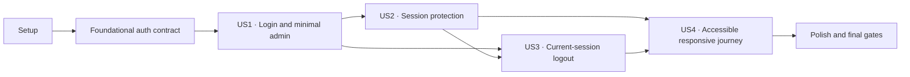

# Tasks: Authentification administrateur

**Input**: Design documents from `/specs/002-admin-authentication/`

**Prerequisites**: `plan.md`, `spec.md`, `research.md`, `data-model.md`, `contracts/`, `quickstart.md`

**Tests**: Les tests sont obligatoires : les quatre user stories comportent des scénarios indépendants et `SC-001` à `SC-010`, la constitution et `contracts/verification.md` exigent la matrice d'accès, les sessions révoquées, les erreurs, la déconnexion, l'accessibilité, le responsive et la non-exposition des secrets.

**Organization**: Les tâches sont groupées par user story. Les contrôles de chaque story sont écrits et observés en échec avant son implémentation. `<cli-timestamp>` désigne exclusivement le préfixe réellement produit par la CLI à T006.

## Format: `[ID] [P?] [Story] Description`

- **[P]**: exécutable en parallèle dans des fichiers distincts, après achèvement de ses prérequis explicites et sans accès concurrent à la même pile Supabase locale
- **[Story]**: user story correspondante (`US1` à `US4`)
- Chaque tâche indique les chemins exacts concernés et reste dans le périmètre connexion/session/déconnexion/accessibilité de 002.

## Phase 1: Setup (Shared Infrastructure)

**Purpose**: Fermer les ambiguïtés documentaires, activer le runtime requis, installer les outils de test et isoler les layouts public/admin sans modifier les URLs publiques.

- [x] T001 Activer Node.js 22 déclaré dans `.nvmrc`, relire avant tout code les guides installés `node_modules/next/dist/docs/01-app/01-getting-started/16-proxy.md`, `node_modules/next/dist/docs/01-app/02-guides/authentication.md`, `node_modules/next/dist/docs/01-app/02-guides/forms.md`, `node_modules/next/dist/docs/01-app/02-guides/server-actions.md` et la documentation/changelog Supabase référencée dans `specs/002-admin-authentication/research.md`, puis y consigner uniquement toute rupture réellement découverte
- [x] T002 Avant T005, consigner dans `specs/002-admin-authentication/quickstart.md` la référence pré-déplacement issue de `doc/design.md` pour `/`, `/services`, `/galerie` et `/contact` : URLs, présence du Header/Footer, titres/textes visibles, cibles des liens, ordre des sections et absence de débordement horizontal à 320/768/1 024 px
- [x] T003 Installer exactement `@playwright/test@1.62.1` et `@axe-core/playwright@4.12.1` comme devDependencies, ajouter dès le Setup dans `package.json` les scripts `test:unit` fondé sur Node 22 et `test:e2e:auth` fondé sur `playwright test`, mettre à jour `package-lock.json`, puis exécuter `npx playwright install chromium webkit` sans ajouter Vitest/Jest
- [x] T004 [P] Configurer Chromium, WebKit, `workers: 1`, `globalSetup`, le serveur `npm run start`, les viewports ciblés et les répertoires de tests Auth dans `playwright.config.ts`
- [x] T005 Déplacer `app/page.tsx`, `app/services/page.tsx`, `app/galerie/page.tsx` et `app/contact/page.tsx` sous `app/(public)/`, créer `app/(public)/layout.tsx` avec `components/header.tsx` et `components/footer.tsx`, puis réduire `app/layout.tsx` au document, aux polices et à `app/globals.css` sans modifier les URLs ni le rendu public

---

## Phase 2: Foundational (Blocking Prerequisites)

**Purpose**: Créer le contrat d'autorisation revocation-aware, ses types, les fixtures locales et la DAL serveur partagés par toutes les user stories.

**⚠️ CRITICAL**: Aucune user story ne commence avant la réussite de cette phase.

- [x] T006 Exécuter `npx supabase migration new --help`, puis créer exclusivement avec la CLI `supabase/migrations/<cli-timestamp>_admin_authentication.sql` via `npx supabase migration new admin_authentication`, sans inventer le préfixe ni modifier un projet hébergé
- [x] T007 Écrire puis observer en échec dans `supabase/tests/database/07_admin_authentication.sql` les assertions pgTAP sur `public.is_current_admin()` : existence, `stable`, `security invoker`, `search_path` vide, `EXECUTE` limité à `authenticated`, admin courant vrai, non-admin/user_metadata/mauvais propriétaire/session expirée ou supprimée faux et appel `anon` refusé
- [x] T008 Après l'échec attendu de T007, ajouter dans `supabase/migrations/<cli-timestamp>_admin_authentication.sql` le wrapper booléen `public.is_current_admin()` déléguant à `private.is_current_admin()`, révoquer les privilèges par défaut/publics et accorder seulement `EXECUTE` à `authenticated`
- [x] T009 Mettre à jour `supabase/tests/database/05_foundation_inventory.sql` et la commande `supabase:test:db` dans `package.json`, reconstruire localement, faire réussir `supabase/tests/database/07_admin_authentication.sql`, puis régénérer et contrôler `lib/supabase/database.types.ts` sans modifier manuellement la base
- [x] T010 [P] Créer dans `tests/admin-auth/local-supabase.ts` le support de fixtures qui impose une URL HTTP loopback exacte, refuse `supabase/.temp/project-ref`, lit `supabase status --output json` uniquement en mémoire, crée/révoque/nettoie des utilisateurs uniques et permet uniquement sur cette pile locale de marquer la ligne `auth.sessions` courante d'une fixture comme expirée, sans journaliser clé, JWT, mot de passe, identifiant de session ou email complet
- [x] T011 Après T010, créer `tests/admin-auth/global-setup.ts` afin d'établir les fixtures admin, non-admin, admin révoquable et `expirable-admin`, de transmettre uniquement les identifiants jetables nécessaires aux workers et de garantir le nettoyage final de chaque utilisateur/session
- [x] T012 [P] Définir les unions strictes `LoginState`, `LogoutState`, `AdminAuthorization` et le contrat de diagnostic sans secret dans `lib/auth/auth-state.ts`
- [x] T013 Après T009 et T012, créer le socle DAL `server-only` dans `lib/auth/admin-session.ts` avec `getAdminAuthorization()`, `getClaims()`, RPC strictement `true`, états `missing_identity`/`not_current_admin`/`unavailable`, identifiant de corrélation sûr, déduplication limitée à `React.cache()` et garde `requireAdminPage()`, sans encore implémenter `requireAdminAction()` ni utiliser de cache partagé

**Checkpoint**: Le RPC, les types, les fixtures et la DAL permettent de prouver une identité, une session courante et le rôle admin sans exposer de capacité privilégiée.

---

## Phase 3: User Story 1 - Se connecter à l'administration (Priority: P1) 🎯 MVP

**Goal**: Permettre à un compte administrateur existant de se connecter, refuser sans énumération les identifiants invalides et comptes non-admin, puis présenter un accueil `/admin` minimal protégé avec une déconnexion fonctionnelle.

**Independent Test**: Avec les fixtures locales, une connexion admin valide atteint `/admin`; email inconnu, mauvais mot de passe et compte non-admin produisent le même refus; le contexte non-admin est nettoyé; un admin déjà connecté ouvrant `/admin/connexion` retourne à `/admin`; aucune interface CRUD n'est affichée.

### Tests for User Story 1

- [x] T014 [P] [US1] Écrire dans `tests/unit/auth/validation.test.ts`, `tests/unit/auth/return-path.test.ts`, `tests/unit/auth/error-mapping.test.ts`, `tests/unit/auth/redaction.test.ts` et `tests/unit/auth/auth-actions.test.ts` les contrats Node 22 pour normalisation/validation — dont refus avant Auth d'un email vide, invalide ou dépassant 254 caractères —, destinations admin sûres incluant le fallback `/admin` pour `/admin/connexion`, `/admin/connexion/`, `/admin/connexion/etape` et `/admin/connexion?returnTo=...`, égalité du texte/catégorie/structure du refus public, sortie diagnostic limitée à catégorie/phase/corrélation et absence de password/token/session/email complet/code fournisseur/erreur brute/trace, une seule vérification `signInWithPassword` par soumission acceptée, nettoyage local incertain sans accès ni faux succès et logout local redirigé uniquement sur succès sans garde de rôle
- [x] T015 [P] [US1] Écrire dans `tests/admin-auth/login.spec.ts` les parcours Playwright admin valide, identifiants invalides, non-admin nettoyé, admin déjà courant toujours redirigé vers `/admin` même avec `returnTo`, destination interne appliquée seulement après nouvelle connexion, fallback externe, accueil minimal sans faux CRUD, déconnexion heureuse et refus de l'accès direct suivant; pour adresse inconnue, mauvais mot de passe et compte non-admin, comparer strictement le texte visible et le contenu annoncé par la région accessible, tandis que T014 compare la catégorie publique et la structure d'état
- [x] T016 [US1] Exécuter `npm run test:unit` puis `npm run test:e2e:auth -- tests/admin-auth/login.spec.ts` et confirmer leurs échecs attendus avant de créer les modules et pages US1

### Implementation for User Story 1

- [x] T017 [P] [US1] Implémenter avec Zod la normalisation email, la borne de 1 à 254 caractères après trim, les erreurs de champs et la présence du mot de passe dans `lib/validations/admin-auth.ts`, sans ajouter de politique de création de mot de passe
- [x] T018 [P] [US1] Implémenter dans `lib/auth/return-path.ts` le validateur pur qui borne la longueur, rejette origine externe, `//`, barre oblique inverse, contrôles, fragment, encodages ambigus, `/admin/connexion` et tout chemin préfixé par `/admin/connexion/`, conserve seulement `pathname + search` et retombe sur `/admin`
- [x] T019 [P] [US1] Implémenter dans `lib/auth/auth-errors.ts` la classification publique par code/statut `validation`/`refused`/`rate_limited`/`unavailable` et dans `lib/auth/auth-diagnostics.ts` la taxonomie diagnostic autorisée — validation, refus d'authentification/autorisation, limitation, indisponibilité identité/autorisation/logout — avec uniquement catégorie, phase et corrélation, sans email complet, code/objet fournisseur, objet d'erreur brut ni trace
- [x] T020 [US1] Implémenter `loginAction` et le contrat serveur complet de `logoutAction` dans `app/(admin)/admin/_actions/auth-actions.ts` avec validation serveur, `signInWithPassword`, contrôle RPC, nettoyage local du non-admin/échec RPC, maintien d'un refus fermé et d'un état indisponible récupérable si ce nettoyage ne peut pas être confirmé, message générique identique, `signOut({ scope: "local" })`, redirection uniquement lorsque `error === null`, état `LogoutState.unavailable` sinon, aucune exigence de rôle pour le nettoyage, et `redirect(..., RedirectType.replace)` hors `try/catch`
- [x] T021 [US1] Créer `app/(admin)/admin/_components/login-form.tsx` comme frontière client basse avec `useActionState`, labels visibles, erreurs liées aux champs, email conservé, mot de passe vidé, attente annoncée et bouton désactivé pendant la soumission
- [x] T022 [US1] Créer `app/(admin)/admin/connexion/page.tsx` comme Server Component avec `searchParams` asynchrone, revalidation de `returnTo`, contrôle fort et redirection obligatoire d'un admin déjà autorisé vers `/admin`
- [x] T023 [US1] Créer `app/(admin)/admin/(protected)/layout.tsx` et `app/(admin)/admin/(protected)/page.tsx` avec garde serveur explicite, barre marque/contexte « Administration », accueil minimal, formulaire natif relié au logout réussi et aucun lien/bouton Prestations ou Galerie non fonctionnel
- [x] T024 [P] [US1] Ajouter dans `app/globals.css` les variables d'état documentées, la carte de connexion, le shell/admin header, les surfaces claires, prune/or, Manrope, Playfair limité au titre principal, rayons 10/14 px, focus `--gold` et contrôles de 44 px conformément à `doc/design.md`
- [x] T025 [US1] Faire réussir `npm run test:unit` et `npm run test:e2e:auth -- tests/admin-auth/login.spec.ts`, puis confirmer que le test indépendant US1 ne dépend d'aucun écran CRUD et que `npm run foundation:check` conserve la fermeture du signup

**Checkpoint**: US1 livre le plus petit incrément sécurisé et démontrable : connexion, accueil protégé minimal et déconnexion heureuse.

---

## Phase 4: User Story 2 - Rester protégé pendant toute la session (Priority: P2)

**Goal**: Maintenir et rafraîchir une session valide tout en refusant au prochain contrôle toute identité absente, non-admin, expirée, révoquée ou privée de rôle, près de chaque page protégée, lecture administrative et action qui lit ou modifie des données administratives; la déconnexion reste l'exception de nettoyage sans donnée métier.

**Independent Test**: La matrice visiteur/non-admin/admin courant/ancien JWT admin révoqué est appliquée à `/admin` et aux gardes d'action; chacun des 20 cycles effectue une navigation vers `/admin`, vérifie « Administration », actualise complètement la page et vérifie à nouveau le contexte, soit 40 contrôles protégés maintenus pour l'admin courant; la première requête après expiration, suppression de session ou retrait du rôle est refusée sans contenu admin ni cache partagé.

### Tests for User Story 2

- [x] T026 [US2] Avant toute création de `requireAdminAction()`, écrire puis observer en échec (a) dans `tests/unit/auth/admin-session.test.ts` sa preuve directe avec dépendance injectée/seam de production : identité absente, RPC faux/non booléen et panne refusent sans exécuter le travail protégé, seuls claims valides + RPC strictement `true` autorisent avec le sujet; et (b) dans `tests/admin-auth/access.spec.ts` les deep links anonymes avec `returnTo`, 20 cycles composés chacun d'une navigation vers `/admin` puis d'une actualisation complète, rôle retiré, session supprimée avec ancien JWT, indisponibilité sans donnée, en-têtes privés/no-store et refus des pages indépendamment du layout; connecter aussi `expirable-admin` par l'interface, expirer localement sa session courante en conservant l'ancien contexte navigateur, puis prouver que la toute première requête `/admin` est refusée sans contenu administratif, sans créer de route de test ni mutation distante

### Implementation for User Story 2

- [x] T027 [P] [US2] Créer le client Supabase response-aware de Proxy dans `lib/supabase/proxy.ts` avec client par requête, `request.cookies.getAll()`, `setAll(cookiesToSet, headers)`, recopie des cookies/en-têtes sur la réponse finale et appel immédiat à `getClaims()`
- [x] T028 [US2] Créer `proxy.ts` avec matcher `/admin/:path*`, préfiltrage limité à l'absence d'identité, construction sûre de `returnTo`, conservation des cookies sur redirect et `Cache-Control: private, no-store` sans décision de rôle, lecture DB ni ancien `middleware.ts`
- [x] T029 [P] [US2] Après la baseline rouge T026, implémenter `requireAdminAction()` dans `lib/auth/admin-session.ts` en réutilisant le socle T013, avec résultat structuré, refus de toute valeur RPC autre que `true` et aucune exécution protégée après refus/indisponibilité, sans `getSession()`, `use cache` ni `unstable_cache`
- [x] T030 [US2] Intégrer les gardes fortes et l'état indisponible sans donnée dans `app/(admin)/admin/connexion/page.tsx`, `app/(admin)/admin/(protected)/layout.tsx`, `app/(admin)/admin/(protected)/page.tsx` et le flux post-authentification de `app/(admin)/admin/_actions/auth-actions.ts`, le layout restant une garde UX non exclusive et `logoutAction()` restant exemptée de rôle
- [x] T031 [US2] Faire réussir `npm run test:unit`—dont `tests/unit/auth/admin-session.test.ts`—et `npm run test:e2e:auth -- tests/admin-auth/access.spec.ts` sur Chromium avec le smoke WebKit, puis confirmer côté application et dans `supabase/tests/database/07_admin_authentication.sql` le refus des contextes non-admin, faux metadata, session expirée et session révoquée

**Checkpoint**: US2 garantit le maintien SSR et le refus revocation-aware à la prochaine demande, même avec un ancien claim admin.

---

## Phase 5: User Story 3 - Se déconnecter explicitement (Priority: P3)

**Goal**: Terminer uniquement la session courante, revenir à la connexion sans donnée privée ni commande administrative active restaurée, refuser la prochaine interaction protégée et fournir une erreur réessayable sans faux succès lorsque la révocation distante n'est pas confirmée.

**Independent Test**: Après logout, accès direct, actualisation, historique et prochaine demande d'un autre onglet sont refusés; les autres sessions/appareils restent hors scope; une erreur distante affiche une incertitude récupérable sans prétendre au succès.

### Tests for User Story 3

- [x] T032 [US3] En conservant les contrats serveur et le happy path déjà testés en T014–T015, écrire puis observer en échec dans `tests/admin-auth/logout.spec.ts` les comportements US3 non encore livrés — attente annoncée du formulaire client et erreur distante visible/réessayable sans faux succès — puis ajouter en régression le scope local, la navigation `replace`, l'accès direct/refresh/historique, le prochain appel multi-onglets et l'ancien JWT après suppression de session; après Retour, prouver l'absence de donnée privée, de marqueur de contenu protégé et de commande administrative active dans le DOM, l'absence de réponse privée restaurée depuis le cache, puis le refus de toute nouvelle interaction ou requête protégée

### Implementation for User Story 3

- [x] T033 [US3] Créer `app/(admin)/admin/_components/logout-form.tsx` avec `useActionState`, attente annoncée, bouton 44 px, erreur récupérable et réutilisation du contrat complet de `logoutAction` livré par T020 sans seconde réécriture de l'action
- [x] T034 [US3] Remplacer le formulaire natif par `app/(admin)/admin/_components/logout-form.tsx` dans `app/(admin)/admin/(protected)/layout.tsx`, puis vérifier que l'état incertain reste visible, réessayable et sans faux succès
- [x] T035 [US3] Faire réussir `tests/admin-auth/logout.spec.ts` sur Chromium/WebKit et confirmer que la déconnexion locale ne promet ni n'effectue une révocation globale des autres sessions

**Checkpoint**: US3 couvre le poste partagé, l'historique et les onglets sans faux succès de révocation.

---

## Phase 6: User Story 4 - Comprendre et utiliser le parcours sur tout écran (Priority: P4)

**Goal**: Rendre succès, attente, validation, refus, limitation, indisponibilité et logout utilisables au clavier, au toucher et avec assistance, sans régression publique aux largeurs cibles.

**Independent Test**: Le parcours complet est réalisable sans souris à 320, 768 et 1 024 px, sans débordement, avec noms/focus/annonces/cibles 44 px; les pages publiques conservent leur structure; WebKit, Safari mobile réel et Firefox sont couverts selon le guide.

### Tests for User Story 4

- [x] T036 [P] [US4] Écrire puis observer en échec dans `tests/admin-auth/accessibility.spec.ts` les assertions Axe et sémantiques sur labels, `aria-invalid`, `aria-describedby`, annonces d'erreur, ordre clavier, focus, taille des cibles et absence de débordement à 320/768/1 024 px; intercepter et retarder le POST de Server Action pour prouver que l'attente devient visible et annoncée dans les 1 000 ms suivant la première activation, que le bouton est désactivé et que les activations répétées produisent exactement un POST de soumission, tandis que `tests/unit/auth/auth-actions.test.ts` prouve exactement un appel à `signInWithPassword` pour cette soumission
- [x] T037 [P] [US4] Écrire puis observer en échec dans `tests/admin-auth/public-regression.spec.ts` les smokes de `/`, `/services`, `/galerie` et `/contact` comparés à la référence T002 : URLs, Header/Footer publics, titres/textes visibles, cibles des liens, ordre des sections et absence de débordement à 320/768/1 024 px, ainsi que l'absence du Header/Footer sur `/admin/connexion` et `/admin`

### Implementation for User Story 4

- [x] T038 [P] [US4] Finaliser dans `app/(admin)/admin/_components/login-form.tsx` et `app/(admin)/admin/_components/logout-form.tsx` les régions `status`/`alert`, relations d'erreur, remount du mot de passe, libellés pending et protection contre soumissions répétées sans multiplier les frontières client
- [x] T039 [P] [US4] Finaliser dans `app/globals.css` les espacements admin 16–24/24–32 px, largeur de carte de connexion, gutters mobiles, focus contrasté, états erreur/information et adaptations aux breakpoints 760/1080 px sans altérer les sélecteurs publics
- [x] T040 [US4] Ajuster `app/(admin)/admin/connexion/page.tsx`, `app/(admin)/admin/(protected)/layout.tsx` et `app/(admin)/admin/(protected)/page.tsx` pour une hiérarchie sémantique française, une zone de message clairement visible et aucune action basée uniquement sur une icône
- [x] T041 [US4] Faire réussir `tests/admin-auth/accessibility.spec.ts` et `tests/admin-auth/public-regression.spec.ts` sous Chromium/WebKit avec les trois largeurs, puis faire repasser `tests/admin-auth/login.spec.ts`, `tests/admin-auth/access.spec.ts` et `tests/admin-auth/logout.spec.ts`
- [ ] T042 [US4] Effectuer les contrôles manuels Safari mobile réel, Firefox, clavier et technologie d'assistance; chronométrer sur navigateur moderne supporté et connexion stable une personne familière des formulaires web depuis l'affichage du formulaire entièrement utilisable jusqu'au contexte « Administration » visible, avec pour seule instruction « accéder à l'administration », et exiger moins de 60 secondes; comparer aussi les pages publiques à la référence T002, puis consigner uniquement les résultats réellement observés dans `specs/002-admin-authentication/quickstart.md`

**Checkpoint**: US4 rend tout le parcours quotidien accessible et responsive sans régression des pages publiques.

---

## Phase 7: Polish & Cross-Cutting Concerns

**Purpose**: Agréger les contrôles, synchroniser les documents et appliquer les gates finaux sans déploiement ni mutation distante.

- [x] T043 Créer `scripts/check-admin-auth.mjs` pour imposer Node 22, loopback et projet non lié, orchestrer tests DB/unitaires/E2E, lint, TypeScript, build et scans, agréger des résultats catégorisés et nettoyer les fixtures sans imprimer clé, JWT, cookie, mot de passe ou email complet
- [x] T044 Ajouter seulement le script agrégateur `auth:check` dans `package.json` après création du runner T043, conserver les scripts `test:unit`, `test:e2e:auth` installés en T003 et `foundation:check`, puis vérifier l'absence de dérive non liée dans `package-lock.json` et de commande distante
- [x] T045 [P] Synchroniser seulement les décisions effectivement implémentées sur authentification, rôle/session, Proxy, DAL, route groups et limites du MVP dans `doc/spec.md` et `doc/architecture.md`
- [x] T046 [P] Synchroniser les tokens/états admin réellement utilisés et le gate Safari dans `doc/design.md`, puis les dépendances, variables inchangées, contrôle Netlify différé et risque 429 documenté dans `doc/infra.md`
- [x] T047 Actualiser les commandes, résultats mesurés, limites manuelles et handoff preview sans prétendre à un déploiement dans `specs/002-admin-authentication/quickstart.md`
- [x] T048 Exécuter `npm run foundation:check` puis `npm run auth:check`, corriger tout échec dans les fichiers de la feature, et confirmer que lint, `tsc --noEmit`, build, pgTAP, Chromium/WebKit, Axe et scans produisent un bilan expurgé conforme à `specs/002-admin-authentication/contracts/verification.md`
- [x] T049 Auditer le résultat contre `specs/002-admin-authentication/spec.md`, `specs/002-admin-authentication/checklists/auth.md` et la constitution, puis documenter dans `specs/002-admin-authentication/quickstart.md` l'absence de signup/reset/MFA/multi-rôles/CRUD/cache partagé/Route Handler Auth/secret client/mutation Supabase hébergée

---

## Dependencies & Execution Order

### Phase Dependencies

- **Phase 1 — Setup**: aucune dépendance ; T004 peut avancer en parallèle après T003, tandis que T005 dépend de la référence publique pré-déplacement créée en T002.
- **Phase 2 — Foundational**: dépend de Setup et bloque toutes les user stories ; T007 précède T008, T009 intègre la migration, T010/T012 peuvent avancer en parallèle et T013 dépend des types et états.
- **Phase 3 — US1**: dépend de Foundational ; livre le MVP connexion/accueil/logout heureux.
- **Phase 4 — US2**: dépend de US1 car elle protège et rafraîchit les pages/actions créées par US1.
- **Phase 5 — US3**: dépend du contrat complet de logout livré en US1 et de US2 pour le refus au prochain appel.
- **Phase 6 — US4**: dépend de US1–US3 afin d'auditer tous les états et les non-régressions.
- **Phase 7 — Polish**: dépend de toutes les stories incluses dans la livraison.

### User Story Dependency Graph



### Within Each User Story

1. Écrire les tests de la story et observer les échecs dus à l'implémentation absente.
2. Ajouter seulement les modules, pages ou styles requis par la story.
3. Faire réussir la story et toutes les stories précédentes sans assouplir un contrôle.
4. Nettoyer chaque fixture et confirmer l'absence de donnée sensible dans les sorties.
5. Valider le checkpoint avant de poursuivre.

## Parallel Opportunities

### User Story 1

```text
T014 unit contracts || T015 browser login contract
(T014 + T015) → T016 failing baseline
T017 validation || T018 return path || T019 error/diagnostic mapping || T024 admin CSS
(T017 + T018 + T019) → T020 actions → T021 form → T022 login page
T020 → T023 protected home → T025 US1 gate
```

### User Story 2

```text
T026 failing direct action-guard proof + browser access matrix (before T029)
T027 Proxy client || T029 strong action guard
T027 → T028 root Proxy
(T028 + T029) → T030 page/action integration → T031 US2 gate
```

### User Story 3

```text
T032 failing logout matrix → T033 logout UI → T034 layout integration → T035 US3 gate
```

### User Story 4

```text
T036 accessibility contract || T037 public regression contract
T038 form semantics || T039 responsive CSS
(T038 + T039) → T040 page semantics → T041 automated gate → T042 manual gate
```

## Implementation Strategy

### MVP First

1. Terminer Setup et Foundational.
2. Livrer US1 : connexion validée, refus générique/non-admin nettoyé, accueil protégé minimal et logout heureux.
3. Arrêter et exécuter le test indépendant US1 avant le rafraîchissement longue durée, les scénarios logout avancés et l'audit accessibilité complet.

US1 est le plus petit incrément démontrable, mais la feature `002-admin-authentication` n'est terminée qu'après US2, US3, US4 et les gates finaux.

### Incremental Delivery

1. **US1**: connexion sûre et accueil minimal sans faux CRUD.
2. **US2**: rafraîchissement SSR, contrôle revocation-aware sur chaque demande et cache privé.
3. **US3**: déconnexion locale robuste, historique et multi-onglets.
4. **US4**: clavier, annonces, responsive, WebKit/Safari et non-régression publique.
5. **Polish**: runner, documentation synchronisée, build et audit de périmètre.

### Scope Guardrails

- Ne créer aucun signup, invitation, récupération/modification de mot de passe, connexion sociale, MFA ou compte client.
- Ne créer aucun écran, lien ou bouton CRUD Prestations/Galerie avant les features correspondantes.
- Ne pas ajouter de rôle, table de rôles, ORM, backend séparé, Route Handler Auth ou `middleware.ts`.
- Ne jamais autoriser depuis Proxy, un layout, `getSession()` ou `user_metadata` ; seule la garde forte et la RLS décident.
- Ne pas activer `cacheComponents`, `use cache`, `unstable_cache` ou un cache partagé pour l'administration.
- Ne jamais exposer ni journaliser capacité privilégiée, JWT, cookie, session, mot de passe ou email complet ; la capacité locale sert uniquement aux fixtures.
- Ne pas ajouter d'`allowedOrigins` large, de clé d'encryption Server Actions, de limite de corps supérieure ou de configuration Netlify spéculative.
- Ne modifier aucun projet Supabase hébergé et ne déployer aucune preview/production sans autorisation distincte.

## Notes

- Les tâches `[P]` touchent des fichiers distincts et ne doivent pas lancer simultanément des mutations sur la même pile Supabase locale.
- Les chemins déplacés sous `(public)` conservent leurs URLs ; vérifier les imports plutôt que dupliquer les pages.
- `redirect()` reste hors des `try/catch` qui interceptent les erreurs applicatives.
- Une valeur RPC `false`, `null` ou en erreur n'autorise jamais l'administration.
- La déconnexion redirige seulement sur `error === null`; une erreur peut avoir nettoyé localement le cookie sans prouver la révocation distante.
- Playwright WebKit et Axe ne remplacent pas Safari mobile réel ni une technologie d'assistance.
- Les refus attendus sont des succès de contrôle ; seul un contrôle réellement en échec reçoit une catégorie d'échec.
