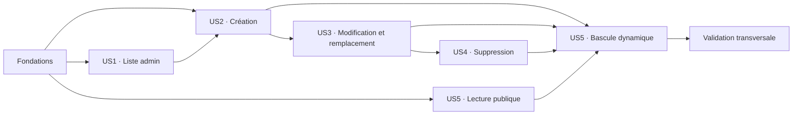

# Tasks: Gestion de la galerie

**Input**: Design documents from `/specs/004-gallery-management/`

**Prerequisites**: [plan.md](./plan.md), [spec.md](./spec.md), [research.md](./research.md), [data-model.md](./data-model.md), [contracts/](./contracts/), [quickstart.md](./quickstart.md)

**Tests**: La spécification exige des matrices pgTAP, Storage, unitaires, Playwright et d’interruption. Les tâches de test précèdent donc l’implémentation de chaque incrément et doivent échouer pour la raison attendue avant que le code correspondant soit écrit.

**Organization**: Les tâches sont groupées par user story afin que chaque incrément puisse être implémenté et validé séparément après les fondations communes.

## Format: `[ID] [P?] [Story] Description`

- **[P]**: Peut être exécutée en parallèle après satisfaction de ses dépendances explicites, car elle cible des fichiers distincts.
- **[Story]**: User story de `spec.md` couverte par la tâche.
- Tous les chemins sont relatifs à la racine du dépôt.

## Phase 1: Setup (Shared Infrastructure)

**Purpose**: Préparer les points d’entrée versionnés de la fonctionnalité sans modifier une cible Supabase hébergée.

- [X] T001 Découvrir la syntaxe installée avec `npx supabase migration new --help`, puis créer la migration `gallery_management` exclusivement via la CLI dans `supabase/migrations/`
- [X] T002 [P] Ajouter les commandes `test:e2e:gallery`, `test:e2e:gallery:scenarios` et `gallery:check` dans `package.json`, puis inclure `gallery-management/**/*.spec.ts` dans `playwright.config.ts`
- [X] T003 [P] Créer les helpers de pile locale, comptes de rôle, données galerie et requêtes des Route Handlers dans `tests/gallery-management/local-supabase.ts` et `tests/gallery-management/fixtures.ts`

---

## Phase 2: Foundational (Blocking Prerequisites)

**Purpose**: Livrer le modèle de données, les politiques, les types et les contrats partagés requis par toutes les stories.

**⚠️ CRITICAL**: Aucune user story ne commence avant que la migration locale, les politiques et les types générés soient validés.

### Database and Storage contract tests

- [X] T004 [P] Étendre les assertions de contraintes de texte, chemins, métadonnées, valeurs par défaut `ordre_affichage=0`/`actif=true` et machine d’état ; accepter exactement les codes fermés `upload_unconfirmed|metadata_unconfirmed|invalid_object_bytes|new_file_cleanup|old_file_cleanup|object_delete_unconfirmed|row_delete_unconfirmed|object_missing|stale_pending_no_object|stale_pending_object_present` et refuser toute autre valeur dans `supabase/tests/database/01_schema_constraints.sql`
- [X] T005 [P] Étendre la matrice de lecture publique aux seules lignes `actif=true AND file_state='ready'` et vérifier qu'aucune métadonnée ni URL de ligne masquée/non prête n'est découvrable par la Data API dans `supabase/tests/database/02_public_access.sql`
- [X] T006 [P] Étendre la matrice admin/non-admin/session révoquée à tous les états galerie dans `supabase/tests/database/03_admin_table_access.sql`
- [X] T007 [P] Spécifier dans `supabase/tests/database/04_storage_policies.sql` le bucket privé, le téléchargement anonyme limité par `storage.allow_any_operation(array['object.get_authenticated_info','object.get_authenticated'])` au chemin d'une ligne active/`ready`, le refus de liste, les réservations WebP admin, les chemins hérités et la suppression ciblée
- [X] T008 [P] Mettre à jour l’inventaire des contraintes, index partiel, GRANT, RLS et politiques dans `supabase/tests/database/05_foundation_inventory.sql`
- [X] T009 [P] Ajouter les assertions pgTAP de transitions valides pour chacun des dix `repair_code`, combinaisons état/code impossibles, identifiants d’opération et éligibilité `pending` à 9 min 59 s/10 min/11 min avec choix exact `stale_pending_no_object|stale_pending_object_present` dans `supabase/tests/database/09_gallery_management.sql`

### Shared implementation

- [X] T010 Implémenter dans le fichier CLI `supabase/migrations/*_gallery_management.sql` les colonnes d’état/réparation, CHECK nommés, index public exact `actif=true AND file_state='ready'`, GRANT explicites, politiques RLS et politiques Storage par opération/chemin incluant le téléchargement anonyme actif/`ready` sans liste, sans modifier le schéma interne Storage
- [X] T011 Régénérer et contrôler les nullabilités du schéma galerie dans `lib/supabase/database.types.ts` avec les scripts de types déclarés dans `package.json`
- [X] T012 [P] Centraliser variantes, états, opérations, codes de réparation, limites d’image, bucket et motif de chemin dans `lib/gallery/constants.ts`
- [X] T013 [P] Définir les DTO `PublicGalleryPhoto`, `AdminGalleryPhoto`, `PreparedImage` et l’état discriminé des actions dans `lib/gallery/types.ts`
- [X] T014 [P] Implémenter les schémas Zod partagés pour UUID, textes normalisés, URL HTTPS, variante, ordre, visibilité et caractéristiques WebP dans `lib/validations/gallery.ts`
- [X] T015 [P] Implémenter les contrats de réponse PostgREST, le tri stable et les conversions de lignes galerie dans `lib/gallery/query-contract.ts` et `lib/gallery/mappers.ts`
- [X] T016 [P] Implémenter la classification expurgée validation/session/interdit/conflit/réseau/quota/réparation/interne dans `lib/gallery/diagnostics.ts`
- [X] T017 Implémenter les préconditions d’état, vérifications `operation_id`, seuil serveur de 10 minutes et transitions pures idempotentes vers `invalid_object_bytes`, `stale_pending_no_object|stale_pending_object_present` et l’enveloppe `replace` sans chemin de `object_missing` dans `lib/gallery/action-core.ts` et `lib/gallery/file-operation-core.ts`
- [X] T018 Étendre `scripts/check-supabase-storage.mjs` pour vérifier le flag privé, le refus de liste anonyme, le téléchargement uniquement d'un chemin actif/`ready`, son refus après masquage/non-`ready`/suppression, les réservations WebP admin, chemins tiers, formats hérités et suppressions via API
- [X] T019 Implémenter un configurateur idempotent fail-closed du bucket privé, de la limite 8 MiB et des MIME hérités via l'API Storage dans `scripts/configure-gallery-bucket.mjs` ; en `--local`, accepter seulement une cible loopback et vérifier la configuration issue de `supabase/config.toml` avec les credentials éphémères de la CLI ; en mode hébergé, exiger `SUPABASE_GALLERY_CONFIG_URL`, `SUPABASE_GALLERY_CONFIG_PROJECT_REF` et une clé dédiée `sb_secret_...` via `SUPABASE_GALLERY_CONFIG_SECRET_KEY`, refuser la clé JWT historique `service_role` et toute discordance URL/référence, masquer le credential dans les sorties, relire la postcondition, documenter son injection ponctuelle puis sa révocation dans `.env.gallery-config.example`, et interdire son import ou chargement par Next.js, Netlify, le bootstrap CRUD et le navigateur
- [X] T020 Enregistrer `09_gallery_management.sql`, le configurateur et les nouveaux contrôles dans `package.json` et `scripts/run-foundation-checks.mjs`, puis faire passer reset, configuration locale, pgTAP, Storage, lint SQL, advisors et dérive de types sur `supabase/` et `lib/supabase/database.types.ts`

**Checkpoint**: La base locale accepte uniquement les états cohérents, la projection publique est exactement `actif=true AND file_state='ready'`, l’administrateur courant est le seul acteur mutable et les types partagés sont disponibles.

---

## Phase 3: User Story 1 - Consulter la galerie administrative (Priority: P1)

**Goal**: Fournir une entrée « Galerie » réelle et une liste privée complète, stable et compréhensible pour les intentions `actif=true|false` et les états `ready|pending|repair_required`.

**Independent Test**: Avec des lignes couvrant les cinq variantes, les deux intentions de visibilité et les trois états de fichier, l’admin voit chaque photo une fois dans un ordre stable avec intention et statut distincts ; anon, non-admin et session révoquée sont refusés ; vide, indisponibilité et session expirée restent distincts.

### Tests for User Story 1

- [X] T021 [P] [US1] Écrire les tests unitaires de mapping, tri stable, statut dérivé, expurgation des chemins privés et contrat de miniature admin — schéma Zod UUID partagé, garde admin, mêmes 404 expurgés et en-têtes privés — dans `tests/unit/gallery/mappers.test.ts`, `tests/unit/gallery/query-contract.test.ts` et `tests/unit/gallery/admin-image-route.test.ts`
- [X] T022 [P] [US1] Écrire les parcours d’accès profond admin/non-admin/session expirée pour `/admin/galerie` dans `tests/gallery-management/access.spec.ts`
- [X] T023 [P] [US1] Écrire les parcours SC-008/SC-025 de liste chargée, 100 photos sur 20 actualisations, pagination stable de 201 photos en 100/100/1 avec unicité des IDs, total/page/précédent/suivant sur 20 navigations, liste vide et lecture indisponible dans `tests/gallery-management/list.spec.ts` et `tests/gallery-management/error-states.spec.ts`
- [X] T024 [P] [US1] Écrire les contrôles Axe, clavier, statuts textuels et responsive 320/768/1024 pour la liste dans `tests/gallery-management/accessibility.spec.ts`

### Implementation for User Story 1

- [X] T025 [US1] Implémenter `getAdminGalleryPhotos(page, pageSize=100)` avec total/range/ordre stable, `getAdminGalleryPhoto(id)` avec garde serveur, colonnes explicites, aucun cache et erreurs classées dans `lib/data/gallery.ts`
- [X] T026 [US1] Implémenter la miniature privée avec `params` asynchrone validé par le schéma Zod UUID partagé de T014, garde admin courante, relecture ID→chemin, téléchargement `cache:'no-store'`, MIME contrôlé, `Content-Disposition:inline`, `X-Content-Type-Options:nosniff`, `Cache-Control:private, no-store` et réponse expurgée dans `app/api/admin/gallery-images/[id]/route.ts`
- [X] T027 [P] [US1] Implémenter les états ligne/carte, miniature via `/api/admin/gallery-images/<id>`, métadonnées, statut, actions disponibles et navigation de pages visible seulement au-delà de 100 dans `app/(admin)/admin/(protected)/galerie/_components/gallery-list.tsx`
- [X] T028 [P] [US1] Créer les états serveur de chargement et d’erreur récupérable dans `app/(admin)/admin/(protected)/galerie/loading.tsx` et `app/(admin)/admin/(protected)/galerie/error.tsx`
- [X] T029 [US1] Créer la page liste privée avec état vide et CTA conditionné à une route fonctionnelle dans `app/(admin)/admin/(protected)/galerie/page.tsx`
- [X] T030 [US1] Ajouter les liens réels « Prestations » et « Galerie » sans navigation factice dans `app/(admin)/admin/(protected)/layout.tsx` et `app/(admin)/admin/(protected)/page.tsx`
- [X] T031 [US1] Ajouter les styles admin galerie conformes aux tokens, rangées desktop, cartes sous 760 px, cibles 44 px et focus visible dans `app/globals.css`

**Checkpoint**: US1 est utilisable seule comme inventaire administratif sécurisé ; aucune mutation ou destination non livrée n’est présentée comme fonctionnelle.

---

## Phase 4: User Story 2 - Ajouter une photo prête à publier (Priority: P2)

**Goal**: Préparer localement un JPEG/PNG/WebP, afficher le Blob final, réserver son chemin, l’envoyer directement à Storage et finaliser exactement une photo ou un état réparable.

**Independent Test**: JPEG orienté, PNG transparent et WebP produisent chacun un WebP ≤1 Mio sans métadonnée ; les fichiers invalides/bombes/animés sont refusés sans résidu ; une interruption après upload reste masquée et récupérable.

### Tests for User Story 2

- [X] T032 [US2] Créer dans `tests/unit/gallery/image-fixtures.ts`, `tests/unit/gallery/alpha-reference-manifest.ts` et `tests/unit/gallery/color-reference-manifest.ts` exactement F01–F20 de SC-003, les 8 objets mensongers SC-022, orientations/profils, une fixture RGBA non redimensionnée avec 25 alphas, une fixture RGBA 2 000×1 000 à gradient horizontal destinée à sortir en 1 600×800 avec 25 positions `arrondi(255×u)`, et six images colorimétriques avec 150 références ; implémenter coordonnées bornées, conversion sRGB→Lab D65/2° et P95 rang 143
- [X] T033 [P] [US2] Écrire les tests de signatures, MIME et extension sur chaque cas F01–F20 — six acceptés, trois vide/supérieurs, six SVG/GIF/APNG/WebP animé/MP4/exécutable et cinq contradictions exactes — ainsi que bornes 8 Mio/8192/25 MP et incohérence de dimensions dans `tests/unit/gallery/image-inspection.test.ts`
- [X] T034 [P] [US2] Écrire les tests RIFF et de validation serveur des 8 objets SC-022, retrait ICCP/EXIF/XMP/inconnus, flags, padding, dimensions et alpha dans `tests/unit/gallery/webp-riff.test.ts` et `tests/unit/gallery/published-image-validation.test.ts`
- [X] T035 [P] [US2] Écrire sous `node:test` les fonctions pures/adaptateurs injectés de dimensions candidates, qualités 0,85/0,80/0,75, seuil 1 Mio, plancher 1200, non-agrandissement et annulation dans `tests/unit/gallery/image-processing.test.ts`
- [X] T036 [P] [US2] Écrire les tests de la matrice exacte titre/libellé à 8 valeurs, valeurs initiales `ordre=0`/`actif=true`, réservation, finalisation avec téléchargement d’octets, double soumission et compensation de création dans `tests/unit/gallery/create-actions.test.ts`
- [X] T037 [P] [US2] Écrire dans `tests/gallery-management/create.spec.ts` les parcours Playwright d’orientation/Canvas/sRGB/alpha réels, aperçu, erreurs liées, ajout, attente, premier rendu administratif, `pending` 9 min 59 s/10 min/11 min et reprise ; comparer aperçu et WebP finalisé sur les 25 alphas non redimensionnés (0/255 exacts, intermédiaires <=1), les 25 alphas redimensionnés 2 000×1 000→1 600×800 (`arrondi(255×u)`, extrémités exactes, intermédiaires <=3) et les 150 CIEDE2000 (médiane <=2, P95 rang 143 <=5)

### Implementation for User Story 2

- [X] T038 [US2] Implémenter le préflight binaire borné JPEG/PNG/WebP et le refus des contenus animés/corrompus dans `lib/gallery/image-inspection.ts`
- [X] T039 [US2] Implémenter le parseur/sanitariseur WebP RIFF pur et le validateur de publication réutilisable côté serveur dans `lib/gallery/webp-riff.ts` et `lib/gallery/published-image-validation.ts`
- [X] T040 [US2] Implémenter orientation, Canvas sRGB avec alpha, boucle séquentielle dimension/qualité et replis Safari bornés dans `lib/gallery/image-processing.ts`
- [X] T041 [US2] Implémenter réservation, contrôle metadata <=1 Mio, téléchargement du chemin réservé, validation serveur RIFF/dimensions/chunks, finalisation et compensation `invalid_object_bytes` idempotente de création dans `app/(admin)/admin/(protected)/galerie/_actions/gallery-actions.ts`
- [X] T042 [P] [US2] Implémenter sélection unique, progression, annulation de génération, libération des ressources et aperçu du Blob exact dans `app/(admin)/admin/(protected)/galerie/_components/image-preparation.tsx`
- [X] T043 [US2] Implémenter le formulaire accessible de création, upload direct `upsert:false`, erreurs par champ et états structurés dans `app/(admin)/admin/(protected)/galerie/_components/gallery-form.tsx`
- [X] T044 [US2] Créer la route fonctionnelle d’ajout protégée et activer son CTA dans `app/(admin)/admin/(protected)/galerie/nouvelle/page.tsx` et `app/(admin)/admin/(protected)/galerie/page.tsx`
- [X] T045 [US2] Implémenter la reprise/compensation d’une création interrompue et la réconciliation réautorisée des `pending` >=10 minutes via un appel unique à l’entrée de liste dans `app/(admin)/admin/(protected)/galerie/_components/repair-gallery-photo-form.tsx`, `app/(admin)/admin/(protected)/galerie/_components/pending-operation-reconciler.tsx` et `app/(admin)/admin/(protected)/galerie/_actions/gallery-actions.ts`
- [X] T046 [US2] Ajouter les styles de groupes, aperçu `object-fit:cover`, caractéristiques finales, erreurs et annonces de traitement dans `app/globals.css`

**Checkpoint**: US2 crée une seule paire ligne-fichier cohérente et laisse toute interruption dans un état persistant, non public et réparable.

---

## Phase 5: User Story 3 - Modifier, classer, masquer ou remplacer une photo (Priority: P3)

**Goal**: Modifier la même photo logique, contrôler sa visibilité et remplacer son fichier par un nouveau chemin sans laisser l’ancien objet inutilisé.

**Independent Test**: Tous les champs et la visibilité changent sans doublon ; une photo masquée reste administrable ; un remplacement réussi conserve l’ID et un seul objet ; toute rupture reste à réparer après rechargement.

### Tests for User Story 3

- [X] T047 [P] [US3] Écrire les tests unitaires de modification, visibilité explicite, conflit concurrent et invalidation conditionnelle du tag dans `tests/unit/gallery/update-actions.test.ts`
- [X] T048 [P] [US3] Écrire les tests unitaires des transitions de remplacement, refus d’octets invalides avant bascule, nettoyage ancien objet et reprise répétée dans `tests/unit/gallery/replace-actions.test.ts`
- [X] T049 [P] [US3] Écrire les parcours Playwright de modification, ordre/variante, masquage/réactivation, remplacement avec nouvel état visible dès le premier rendu administratif post-réponse sans actualisation manuelle, miniature absente/audit ciblé et session retirée pendant l’édition dans `tests/gallery-management/update-replace.spec.ts`

### Implementation for User Story 3

- [X] T050 [US3] Implémenter les actions réautorisées de métadonnées, visibilité et audit `markGalleryPhotoObjectMissingAction` avec relecture du chemin, distinction absence/réseau, génération serveur de l’enveloppe `replace/object_missing` sans chemin, détection de conflit et `updateTag('galerie')` dans `app/(admin)/admin/(protected)/galerie/_actions/gallery-actions.ts`
- [X] T051 [P] [US3] Implémenter le formulaire unitaire Masquer/Réactiver avec libellé, pending et résultat non prédictif dans `app/(admin)/admin/(protected)/galerie/_components/gallery-visibility-form.tsx`
- [X] T052 [US3] Étendre le formulaire partagé à l’édition des champs confirmés sans autoriser l’édition générale d’une ligne `pending` dans `app/(admin)/admin/(protected)/galerie/_components/gallery-form.tsx`
- [X] T053 [US3] Créer la route protégée à `params` asynchrone pour modifier une photo existante ou produire un not-found sûr dans `app/(admin)/admin/(protected)/galerie/[id]/modifier/page.tsx`
- [X] T054 [US3] Implémenter réservation sur nouveau UUID, upload sans upsert, téléchargement/validation serveur avant bascule atomique, retrait de l’ancien objet et compensation du remplacement dans `app/(admin)/admin/(protected)/galerie/_actions/gallery-actions.ts`
- [X] T055 [US3] Étendre la réparation pour choisir depuis l’état serveur entre finaliser, retirer le nouveau résidu ou nettoyer l’ancien objet dans `app/(admin)/admin/(protected)/galerie/_components/repair-gallery-photo-form.tsx`
- [X] T056 [US3] Relier Modifier, Masquer/Réactiver, Remplacer et Réparer à chaque état autorisé, puis déclencher l’audit ciblé sur erreur de miniature admin dans `app/(admin)/admin/(protected)/galerie/_components/gallery-list.tsx`

**Checkpoint**: US3 préserve l’identité logique, publie uniquement les lignes `ready` et converge sans upsert ni chemin fourni librement par le client.

---

## Phase 6: User Story 4 - Supprimer définitivement une photo et son fichier (Priority: P4)

**Goal**: Supprimer une cible après confirmation accessible, en retirant d’abord l’objet exact puis la ligne, avec reprise sûre en cas d’échec partiel.

**Independent Test**: Annuler ne change rien ; confirmer retire exactement la ligne et l’objet ciblés ; objet déjà absent converge ; échec après retrait objet reste masqué, réparable et ne touche aucune autre photo.

### Tests for User Story 4

- [X] T057 [P] [US4] Écrire les tests unitaires de début/finalisation de suppression, objet déjà absent, mauvais `operation_id` et ligne non retirée dans `tests/unit/gallery/delete-actions.test.ts`
- [X] T058 [P] [US4] Écrire les parcours Playwright du dialogue, annulation, focus/Escape, cible absente dès le premier rendu administratif après la réponse de suppression sans actualisation manuelle, succès complet et reprise partielle dans `tests/gallery-management/delete.spec.ts`

### Implementation for User Story 4

- [X] T059 [US4] Implémenter masquage préalable, suppression Storage par `remove([exactPath])`, retrait ciblé de ligne et état `row_delete_unconfirmed` dans `app/(admin)/admin/(protected)/galerie/_actions/gallery-actions.ts`
- [X] T060 [P] [US4] Implémenter le dialogue titré avec miniature, conséquence, focus initial Annuler, Escape et restauration du focus dans `app/(admin)/admin/(protected)/galerie/_components/delete-gallery-photo-dialog.tsx`
- [X] T061 [US4] Étendre la réparation à la confirmation d’absence objet puis au retrait idempotent de ligne dans `app/(admin)/admin/(protected)/galerie/_components/repair-gallery-photo-form.tsx`
- [X] T062 [US4] Relier Supprimer uniquement aux états autorisés et séparer visuellement l’action destructive dans `app/(admin)/admin/(protected)/galerie/_components/gallery-list.tsx` et `app/globals.css`

**Checkpoint**: US4 n’annonce un succès qu’après absence confirmée de l’objet et de la ligne, avec une reprise ciblée pour tout résultat intermédiaire.

---

## Phase 7: User Story 5 - Consulter la galerie publique actualisée (Priority: P5)

**Goal**: Remplacer les tableaux statiques par la projection Supabase `actif=true AND file_state='ready'`, conserver exactement la composition publique et reprendre les neuf images sans interruption.

**Independent Test**: Les cinq variantes, quatre combinaisons de sections, champs facultatifs, liens HTTPS, ordre stable et neuf images initiales sont conformes ; aucune photo masquée/en cours/à réparer n’est révélée et une mutation apparaît sous cinq secondes.

### Tests for User Story 5

- [X] T063 [P] [US5] Écrire dans `tests/unit/gallery/public-data.test.ts` et `tests/unit/gallery/public-image-route.test.ts` les contrats de projection sans `storage_path`, séparation main/social, cache sans cookies, URL `/api/gallery-images/<id>`, réponse 200 active/`ready`, même 404 expurgé pour UUID invalide/masqué/non-`ready`/absent, en-têtes `private, no-store`/`nosniff` et aucune redirection ou fuite Storage
- [X] T064 [P] [US5] Écrire dans `tests/gallery-management/public-gallery.spec.ts` les parcours variantes/projection exacte, sections/champs/liens, objet retiré, mise à jour <5 s, rendu du WebP de T037, refus de liste anonyme et même URL applicative passant de 200 à 404 dès la première demande après masquage, `pending`, `repair_required` ou suppression ; mesurer aussi le lazy selon SC-012, une somme `layout-shift` galerie égale à 0 et, avec neuf fixtures de 1 Mio à 320 × 800 px, au plus deux demandes/2 Mio pendant les cinq secondes suivant `load` sans défilement selon SC-026
- [X] T065 [P] [US5] Écrire la baseline des neuf images et les régressions `/`, `/services`, `/galerie`, `/contact` dans `tests/gallery-management/public-regression.spec.ts`
- [X] T066 [P] [US5] Écrire le contrôle local de `sharp` exactement 0.35.3 dans `package.json`/`package-lock.json` et importé uniquement par `scripts/bootstrap-gallery.mjs`, du manifeste SHA-256 source/sortie, des dimensions à un pixel près et du SSIM >=0,97 des neuf WebP face aux sources opaques orientées/sRGB et redimensionnées aux dimensions exactes de sortie ; calculer sur la luminance sRGB 8 bits `Y=0,299R+0,587G+0,114B`, fenêtre gaussienne 11×11 sigma 1,5, `K1=0,01`, `K2=0,03`, `L=255`, bords réfléchis et moyenne de tous les pixels, puis tester bootstrap idempotent, refus de cible liée/distante et divergences sans écrasement dans `scripts/check-gallery-bootstrap.mjs` et `tests/unit/gallery/bootstrap-visual-fidelity.test.ts`

### Implementation for User Story 5

- [X] T067 [US5] Implémenter `getPublicGalleryPhotos()` avec client anon, colonnes sans `storage_path`, URL même origine par ID, filtres/tri explicites, `use cache`, `cacheLife('days')` et `cacheTag('galerie')` dans `lib/data/gallery.ts`
- [X] T068 [P] [US5] Implémenter le Client Component minimal qui retire localement une image en erreur puis extraire la grille principale serveur avec variantes, repli standard, alt, dimensions, `sizes`, `unoptimized` et priorité limitée au premier écran dans `components/gallery-image.tsx` et `components/gallery-grid.tsx`
- [X] T069 [P] [US5] Extraire le journal social serveur en réutilisant le repli image, sans CTA inventé et avec cartes non interactives sans HTTPS dans `components/social-gallery.tsx`
- [X] T070 [US5] Préparer dans la page publique le rendu de la source administrable et créer ses états chargement/indisponibilité, tout en conservant explicitement les tableaux statiques comme source active et sans effectuer la bascule avant T074, dans `app/(public)/galerie/page.tsx`, `app/(public)/galerie/loading.tsx` et `app/(public)/galerie/error.tsx`
- [X] T071 [US5] Implémenter la livraison publique d'octets privés avec `params` asynchrone validé par le schéma Zod UUID partagé de T014, revalidation du contexte public anonyme par relecture active/`ready` ID→chemin avec client anon sans cookies, téléchargement sous RLS avec fetch `cache:'no-store'`, MIME contrôlé, `Content-Disposition:inline`, `X-Content-Type-Options:nosniff`, `Cache-Control:private, no-store`, 404 expurgé et aucune URL signée/redirection dans `app/api/gallery-images/[id]/route.ts` et `lib/gallery/image-delivery.ts`
- [X] T072 [US5] Installer `sharp@0.35.3` comme devDependency exacte en mettant à jour `package.json` et `package-lock.json`, puis définir les neuf UUID/chemins, alt, variantes, ordres, dimensions de sortie et SHA-256 source/WebP attendus sans URL Instagram dans `scripts/bootstrap-gallery-data.mjs`
- [X] T073 [US5] Implémenter le bootstrap `--local`/cible explicitement autorisée qui exige le bucket privé vérifié par T019, convertit les neuf JPEG par `sharp` en sRGB WebP sans métadonnées, vérifie manifeste/RIFF, puis réserve-upload-revalide-finalise sous session admin normale avec idempotence et arrêt sur divergence dans `scripts/bootstrap-gallery.mjs`
- [X] T074 [US5] Exécuter deux fois le bootstrap local, contrôler exactement neuf paires, puis et seulement après succès de `scripts/check-gallery-bootstrap.mjs` basculer `app/(public)/galerie/page.tsx` vers `getPublicGalleryPhotos()` et retirer les tableaux métier statiques sans fallback
- [X] T075 [US5] Ajuster uniquement les sélecteurs nécessaires aux données dynamiques, aux sections vides et au repli standard sans modifier les tokens/breakpoints dans `app/globals.css`

**Checkpoint**: US5 sert uniquement les lignes publiques cohérentes, conserve le rendu de référence et ne dépend plus des neuf tableaux métier codés en dur.

---

## Phase 8: Polish & Cross-Cutting Concerns

**Purpose**: Prouver les propriétés transversales, synchroniser la documentation et préparer une validation locale/preview sans mutation de production.

- [X] T076 Implémenter exactement les 12 interruptions SC-006 — C1 réservation create avant upload, C2 upload avant validation/finalisation, C3 octets invalides avant nettoyage confirmé, C4 `ready` avant réponse ; R1 masque/réserve avant upload, R2 upload avant validation, R3 validation avant bascule, R4 bascule avant retrait ancien, R5 retrait ancien avant `ready` ; D1 `pending/delete` avant retrait objet, D2 retrait objet avant retrait ligne, D3 retrait ligne avant réponse — puis vérifier après rechargement et reprise les états/objets/idempotence attendus, ainsi que réseau/quota/conflit/session, dans `lib/gallery/e2e-scenario.ts` et `scripts/run-gallery-scenario-tests.mjs`
- [X] T077 Ajouter après T076 la matrice d’endurance 30 créations, 20 remplacements, 20 suppressions et l’inventaire final ligne-objet dans `scripts/run-gallery-scenario-tests.mjs`
- [X] T078 Ajouter l’orchestrateur fail-closed qui refuse une cible non-loopback/liée et enchaîne les contrôles galerie avec diagnostics expurgés dans `scripts/check-gallery-management.mjs`
- [X] T079 Mettre à jour `package.json` et `scripts/run-foundation-checks.mjs` pour inclure tous les tests unitaires galerie, pgTAP 09, bootstrap, scénarios et `gallery:check`
- [X] T080 [P] Étendre le scan des bundles, messages et sorties partageables aux chemins/opérations galerie ainsi qu'aux trois noms `SUPABASE_GALLERY_CONFIG_*` et aux valeurs `sb_secret_`, puis prouver que le configurateur et `.env.gallery-config.example` ne peuvent entrer dans le graphe runtime dans `scripts/scan-build-secrets.mjs` et `tests/unit/gallery/diagnostics.test.ts`
- [X] T081 Exécuter reset, pgTAP, Storage, advisors, types, unitaires, lint, typecheck, build, auth, prestations, galerie Chromium/WebKit et scan via `package.json`, puis consigner les résultats dans `specs/004-gallery-management/validation-report.md`
- [X] T082 Formaliser avant le test utilisateur le protocole reproductible SC-002/SC-013, les cinq consignes sans indice, les données de départ, le chronométrage, les critères première tentative et la grille anonymisée réussite/aide/incident dans `specs/004-gallery-management/usability-test-protocol.md`
- [ ] T083 Réaliser après T081 et T082 les contrôles manuels 320/375/768/1024/1440, clavier, Firefox, technologie d’assistance, Safari mobile caméra/alpha/P3/limites, puis faire exécuter le protocole par un participant cible non technique sans aide et consigner réussite par tâche, temps, preuves et limites dans `specs/004-gallery-management/validation-report.md`
- [ ] T084 Vérifier après T083 une preview Netlify et un projet Supabase de test explicitement autorisés pour bucket privé, refus de liste, même URL 200→404 immédiat, en-têtes image `private, no-store`, cache métadonnées <5 s, validation serveur <=1 Mio et ancien onglet ; mesurer une consultation complète sans doublon à au plus neuf invocations/9 Mio, extrapoler 1 000 consultations à au plus 9 000 invocations/9 000 Mio, comparer aux quotas Netlify officiels alors en vigueur, prouver l'absence des trois variables `SUPABASE_GALLERY_CONFIG_*` dans Netlify et l'échec de l'ancienne clé après sa révocation, puis consigner sans déployer en production dans `specs/004-gallery-management/validation-report.md`
- [X] T085 Réconcilier les décisions réellement implémentées avec `doc/spec.md`, `doc/design.md`, `doc/architecture.md`, `doc/infra.md`, tous les contrats de `specs/004-gallery-management/contracts/` et `specs/004-gallery-management/quickstart.md`

---

## Dependencies & Execution Order

### Phase Dependencies

- **Phase 1 — Setup**: démarre immédiatement.
- **Phase 2 — Foundational**: dépend de T001 pour le fichier de migration et bloque toutes les user stories.
- **US1 (Phase 3)**: démarre après Phase 2 et fournit l’inventaire admin utilisé par les stories suivantes.
- **US2 (Phase 4)**: démarre après Phase 2 ; T044/T045 s’intègrent à la liste US1.
- **US3 (Phase 5)**: dépend de la préparation d’image et des opérations create/repair de US2.
- **US4 (Phase 6)**: dépend du socle de réparation exposé par US2 et intégré par US3.
- **US5 (Phase 7)**: sa lecture/composition peut commencer après Phase 2 ; la bascule T074 attend les actions US2–US4 et le bootstrap vérifié.
- **Phase 8 — Polish**: dépend de toutes les stories incluses dans la livraison.

### User Story Dependency Graph



### Within Each User Story

1. Écrire les tests et constater l’échec attendu.
2. Implémenter les modules purs et validations.
3. Implémenter les accès données/actions sécurisées.
4. Implémenter l’interface et l’intégration.
5. Faire passer le test indépendant de la story avant la story suivante.

## Parallel Opportunities

### User Story 1

```text
T021 mapping/query contract || T022 accès || T023 états de liste || T024 accessibilité
T027 liste UI || T028 loading/error
```

### User Story 2

```text
T032 fixtures d'abord, puis T033 inspection || T034 RIFF/serveur || T035 traitement pur || T036 actions || T037 E2E
Après les contrats : T042 préparation client en parallèle de T041 actions serveur
```

### User Story 3

```text
T047 métadonnées/visibilité || T048 remplacement || T049 E2E
Après T050 : T051 formulaire visibilité en parallèle de T053 route d’édition
```

### User Story 4

```text
T057 actions de suppression || T058 dialogue/E2E
Après le contrat : T060 dialogue en parallèle de T059 actions serveur
```

### User Story 5

```text
T063 données/cache || T064 galerie publique || T065 régression || T066 bootstrap
Après T067 : T068 grille principale || T069 journal social
```

## Implementation Strategy

### Increment 1 — User Story 1

1. Terminer Setup et Foundational.
2. Livrer US1 comme inventaire administratif sécurisé, sans bouton factice.
3. Valider indépendamment accès, ordre, états et responsive.
4. Continuer vers US2 pour obtenir le premier incrément réellement mutable ; US1 seule n'est pas le MVP fonctionnel.

### Incremental Delivery

1. **Foundation + US1**: consulter toutes les photos et états en sécurité.
2. **US2**: ajouter une photo WebP cohérente ou réparable.
3. **US3**: modifier, masquer, réactiver et remplacer sans orphelin.
4. **US4**: supprimer ligne et objet avec compensation.
5. **US5**: basculer les neuf images et la galerie publique sur les données administrables.
6. **Polish**: exécuter les matrices complètes et documenter les gates manuelles/preview.

Le MVP fonctionnel est atteint uniquement après US1 à US5 et leur validation croisée ; aucun checkpoint antérieur ne doit être présenté comme une livraison complète de gestion de galerie.

### Scope Control

- Ne pas ajouter upload multiple, drag-and-drop, recadrage, transformation d’image dans le runtime serveur, historique, publication Instagram ou clé JWT historique `service_role`. Le credential `sb_secret_...` dédié de T019 est limité au processus ponctuel du script de configuration, jamais chargé par l'application, Netlify, le bootstrap CRUD ou le navigateur, puis révoqué après vérification. La seule dépendance d’image supplémentaire autorisée est `sharp@0.35.3`, épinglé exactement en devDependency/lockfile et importé exclusivement par `scripts/bootstrap-gallery.mjs`.
- Ne pas retirer les données statiques avant que les neuf paires du bootstrap soient vérifiées.
- Ne pas considérer la preview ou la configuration locale comme une autorisation de migration/déploiement en production.

## Notes

- Une tâche marquée `[P]` ne démarre qu’après ses dépendances de phase, même si elle cible des fichiers distincts.
- Les mutations réautorisent toujours la session et le rôle, valident avec Zod et relisent l’état serveur.
- Toute modification de `storage.objects` passe par les politiques ou l’API Storage ; aucun SQL direct ne crée, remplace ou supprime un objet.
- Toute modification de configuration du bucket passe par l'API Storage et le script T019 ; aucun SQL direct ne modifie `storage.buckets`.
- Le tag public `galerie` est invalidé dès qu’une projection active change ou qu’un masquage de sécurité devient nécessaire.
- Les contrôles hébergés exigent une cible de test explicitement vérifiée ; ce fichier n’autorise aucune mutation de production.

## Phase 9: Convergence

- [X] T086 Corriger `components/gallery-image.tsx` pour que seules les deux images immédiatement visibles restent `loading="eager"` et que toute carte différée conserve le montage contrôlé existant tout en étant déclarée `loading="lazy"`, sans priorité ni requête avant le seuil contractualisé, puis couvrir la régression dans `tests/gallery-management/public-gallery.spec.ts` per FR-029 et SC-012 (contradicts)
- [X] T087 Masquer indépendamment la galerie principale et le journal social en filtrant avant rendu dans `components/gallery-grid.tsx`, `components/social-gallery.tsx` et `app/(public)/galerie/page.tsx`, afficher le message neutre unique seulement lorsque les deux collections sont vides et tester les quatre combinaisons de SC-017 dans `tests/gallery-management/public-gallery.spec.ts` per FR-038, SC-017 et US5/AC8 (contradicts)
- [X] T088 Transmettre `externalUrl` aux cartes principales et rendre dans `components/gallery-image.tsx` une carte principale interactive uniquement pour une URL HTTPS validée, avec nom accessible indiquant la destination et comportement non interactif inchangé en son absence, puis tester liens présents, absents et champs facultatifs dans `tests/gallery-management/public-gallery.spec.ts` per FR-028 et US5/AC5 (partial)
- [X] T089 Centraliser les libellés français des cinq variantes, les utiliser dans le formulaire et la liste, piloter la variante sélectionnée dans `gallery-form.tsx` et rendre dans `image-preparation.tsx` un aperçu exact encadré selon son cadrage public `object-fit: cover` sans modifier le Blob téléversé, avec contrôles create/replace dans `tests/gallery-management/create.spec.ts` et `tests/gallery-management/edit-replace.spec.ts` per FR-008, FR-012 et US2/AC1 (partial)
- [X] T090 Mapper tous les codes d’inspection et de préparation d’image vers des explications françaises actionnables, rendre dans `gallery-form.tsx` toutes les catégories expurgées validation/session/interdit/conflit/réseau/quota/réparation/interne, associer aussi les erreurs de variante, ordre et visibilité avec `aria-invalid`/`aria-describedby`, conserver les valeurs récupérables et étendre les tests unitaires/Playwright correspondants per FR-010, FR-023, FR-034 et US2/AC3 (partial)
- [X] T091 Ajouter un mécanisme de message de succès post-navigation, limité à la même session et consommé au premier rendu administratif, pour création, modification, masquage, réactivation, remplacement et suppression ; alimenter ce message uniquement après la confirmation complète de l’action et l’annoncer avec `role="status"` sans produire de faux succès lors des états partiels, puis couvrir chaque parcours Playwright per FR-024, US2/AC2, US3/AC1 et US4/AC3 (partial)
- [X] T092 Afficher dans `gallery-list.tsx` le format MIME contrôlé avec les dimensions et le poids du fichier, sans exposer le chemin Storage, puis mettre à jour le contrôle de liste administrative per plan: admin UI contract (partial)
- [X] T093 Vérifier que `app/(public)/galerie/page 2.tsx` n’est référencé par aucun parcours ni outil, puis retirer cette copie obsolète des neuf tableaux métier statiques ou la déplacer hors du code applicatif si une conservation documentaire est justifiée, et faire échouer la régression si ces tableaux reviennent sous `app/` per FR-030 et T074 (contradicts)
